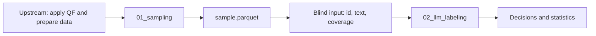

# AutoClean_Filters

This repository runs two stages: **sample a prepared dataset, then label the
sample with an LLM**. The dataset producer applies its quality filter (QF)
and supplies data in the agreed input schema. Sampling selects rows and
preserves the existing QF columns. Filter packs store QF versions separately.
Import the filter once, then pass its name with `--filter-pack` when sampling
or running the pipeline. Labeling inherits the version recorded by sampling.

This README is the current operating guide. It contains the input contract,
commands, output descriptions, filter-version workflow, and troubleshooting.

- [Workflow and repository layout](#overview)
- [Environment setup](#setup)
- [Dataset input contract](#input-schema)
- [Run sampling](#sampling)
- [Sample outputs](#sample-output)
- [Run the full pipeline](#run-pipeline)
- [Current LLM labeling behavior](#labeling)
- [Filter packs and version tools](#filters)
- [Filter import requirements](#filter-authoring)
- [Check results and troubleshoot](#troubleshooting)
- [Local checks and migration](#development)

<a id="overview"></a>

## Workflow and repository layout



| Responsibility | Location |
|---|---|
| Apply QF, prepare the schema, compute signals and required rule vectors | Upstream dataset preparation |
| Sample by existing `qf_reason` and fetch matching raw text | `pipeline/01_sampling/` |
| Judge document text with an LLM | `pipeline/02_llm_labeling/` |
| Submit jobs, adapt input, shard work, merge responses | `pipeline/run_pipeline.sh`, `pipeline/scripts/` |
| Preserve filter code, parameters, and source history | `filters/packs/` |

```text
README.md                         Complete operating guide
requirements.txt                  Local Python dependencies
pipeline/
├── 01_sampling/
│   ├── sample.py                 Sampling entry point, flow, and metadata
│   └── shard_io.py               Parquet reads and raw-text joins
├── 02_llm_labeling/
│   ├── run_inference.py          Client for an existing judge endpoint
│   ├── judge_prompt.txt          Judgment rubric
│   └── compute_label_stats.py    Statistics over existing decisions
├── configs/
│   ├── datasets/keenable.yaml    Prepared-dataset locations and column declarations
│   └── judge_round_targets.conf  Sampling targets for a run
├── scripts/
│   ├── run_sample.sbatch         Sampling job
│   ├── bad_nodes.txt             Exclusion list for manual sampling submissions
│   ├── make_blind_input.py       Sample to blind JSONL
│   ├── shard_blind_input.py      Split pending documents
│   ├── serve_judge.sbatch        Judge serving job
│   └── serve_judge_vllm.sh       Start vLLM endpoints
├── filter_provenance.py          Shared filter identity and run checks
└── run_pipeline.sh              Run the two stages
filters/
├── packs/                        One directory per filter version
└── scripts/                      Import versions, export parameters, compare upstream
tests/                            Local integration checks
docs/archive/                     Historical designs and run provenance
```

The sampling directory contains only two Python files. Configuration and
cluster scripts live in the pipeline's shared directories. The
[archive](docs/archive/README.md) preserves historical notes; use this guide
for current commands and contracts.

<a id="setup"></a>

## Environment setup

Run the commands below from the repository root. Use Python 3.10+ and install
numpy, pandas, pyarrow, and PyYAML from [requirements.txt](requirements.txt):

```bash
python -m pip install -r requirements.txt
export PIPELINE_PYTHON=/absolute/path/to/that/python
```

Sampling and filter-parameter tools can run locally. The full pipeline also
requires:

- Slurm commands: `sbatch`, `squeue`, and `scancel`.
- Readable prepared data, a shard manifest, and a raw-text mirror.
- Apptainer, a readable vLLM ROCm image, and model snapshot files.
- Cluster resources matching the submission scripts.

The sampling job currently requests the `ifm_us` account, `test` QoS, and
one node with 64 CPUs / 256 GB. The judge job requests the `ifm_us`
account/QoS, `hermes-2` partition, and eight MI210 GPUs. On another cluster,
adjust the resources in `pipeline/scripts/*.sbatch` and the image location.

<a id="input-schema"></a>

## Dataset input contract

**Every dataset must be prepared upstream to this contract.** Sampling does
not apply QF, convert arbitrary source schemas, or generate missing QF
columns. The supported input kind is `qf_output_parquet`.

Supply one YAML per dataset. See
[pipeline/configs/datasets/keenable.yaml](pipeline/configs/datasets/keenable.yaml):

```yaml
name: my_dataset
kind: qf_output_parquet
qf_root: /data/my_dataset/qf
raw_root: /data/my_dataset/raw
manifest: /data/my_dataset/shards.txt
reason_column: qf_reason
columns:
  id: uid
  url: url
  vendor_lang: language
  text_raw: text
```

| Setting | Meaning |
|---|---|
| `qf_root` | QF-output Parquet shards containing both accepted and rejected documents |
| `raw_root` | Matching shard filenames containing the pre-QF text |
| `manifest` | One shard filename per line, relative to those roots |
| `reason_column` | Fixed to `qf_reason` |
| `columns.id` | Fixed to `uid` |
| Other `columns` entries | Declare existing URL, vendor-language, and raw-text column names; no columns are renamed |

Use absolute data paths. Keep the corpus and manifest version fixed for
reproducibility. The Keenable configuration includes shared data paths and
a manifest under a user project; a new dataset must provide its own locations.

### Parquet columns

| Column | Requirement and meaning |
|---|---|
| `uid` | Stable, non-null string ID, unique across the dataset |
| `qf_reason` | Non-null string: `kept`, or the first rule/stage that rejected the document |
| `text` | String containing the text as seen/kept by QF |
| Configured URL and vendor-language columns | Must exist; individual values may be null |
| `fast_text_lang`, `fast_text_lang_score` | Preserved when present |
| Signals such as `word_count` | Already computed upstream; may be null for documents rejected before the signal stage |
| Rule verdicts and summaries | Prepared upstream when needed and copied unchanged |

Sampling does not require any particular filter's complete signal/verdict
set and never computes missing columns. Extra columns pass through except
for the existing drop list: `title`, `description`, `is_best_duplicate`,
and `orig_text_has_dup_lines`. The first shard is probed for columns; all
shards in the dataset must follow the same schema.

When rule verdicts are supplied, use these names and meanings:

| Column | Meaning |
|---|---|
| `viol_<rule>` | Whether this rule is violated, evaluated independently; null off-stage |
| `n_violations` | Number of violated rules; null off-stage |
| `sole_blocker` | Rule name when exactly one rule is violated, otherwise empty |
| `first_blocking` | First violated rule in chain order; should match `qf_reason` on signal-stage documents |

The CC pack uses the original `DataAttributes` signal names. N-gram arrays
are flattened into `common_ngram_frac_<n>` and `dup_ngram_frac_<n>`.
Rule names preserve the production counter names without `doc_removed_by_`,
including the historical spelling `alpha_charcter`. Dataset preparation
owns agreement between these names, their semantics, and the producing
filter version.

### Raw-text mirror

`raw_root` must provide matching shard filenames, IDs, and the configured
raw-text column. Matching row counts and order allow direct reads of the
selected rows, with an ID check. If counts or order differ, the reader
joins by ID within that shard. The producer must ensure every selected ID
has a raw-text counterpart. Text is read, never reconstructed.

`text` is the QF view; `text_raw` is the pre-QF text. They are the final two
columns in a sample. Empty strings are valid for sampling, for example in
the `empty_text` stratum. The current labeling adapter requires non-empty
text, so select appropriate strata for a labeling run using sampling targets.

<a id="sampling"></a>

## Run sampling

```bash
"$PIPELINE_PYTHON" pipeline/01_sampling/sample.py \
    --dataset pipeline/configs/datasets/keenable.yaml \
    --filter-pack cc_baseline \
    --out /path/to/new_sample \
    --pool-shards 3 --target-default 3 --target kept=10 --processes 3
```

| Argument | Default / purpose |
|---|---|
| `--dataset` | Required prepared-dataset YAML |
| `--filter-pack` | Required saved version name from `filters/packs/`, such as `cc_baseline` |
| `--out` | Required sample output directory |
| `--pool-shards` | 1,200; maximum size of the seeded shard pool |
| `--target-default` | 1,500 documents per `qf_reason` without an override |
| `--target LABEL=COUNT` | Repeatable per-stratum override; includes `kept=10000` by default |
| `--seed` | 7 |
| `--processes` | 32 |

The selected pack declares which filter produced the input dataset. Sampling
records its name and content fingerprint in `meta.json` without executing
filter code. Choose the actual producing version; this declaration does not
verify how the upstream dataset was generated.

Use `--target-default 0` plus explicit targets to select particular strata.
The built-in `kept=10000` override still applies unless replaced; use
`--target kept=0` to exclude kept documents. A stratum contributes at most
its available number of documents.

The flow is: choose the shard pool, count labels, draw uniform global ranks
within each label, fetch the selected row groups and raw text, then write
the sample. Identical inputs, pool size, and seed select the same document
set. Output row order may vary with worker completion order.

To submit just sampling through Slurm:

```bash
mkdir -p logs
sbatch --exclude=$(grep -v '^#' pipeline/scripts/bad_nodes.txt | paste -sd,) \
    pipeline/scripts/run_sample.sbatch \
    pipeline/configs/datasets/keenable.yaml /path/to/new_sample \
    --filter-pack cc_baseline
```

Submit from the repository root. From another location, set
`QF_SAMPLING_ROOT` to the absolute `pipeline/01_sampling` directory.
The job uses the exported `PIPELINE_PYTHON`, or `python3` if unset.
The manual command above uses `bad_nodes.txt`; the full runner currently
does not apply that exclusion list automatically.

<a id="sample-output"></a>

## Sample outputs

| File | Content |
|---|---|
| `sample.parquet` | Selected input rows, plus `shard`, `row_idx`, `strat`, and `text_raw` |
| `meta.json` | Filter version, input locations, code revision, seed, pool, targets, achieved counts, and read errors |
| `pool_shards.txt` | The usable shard pool |

`strat` currently equals `qf_reason`. `shard` and `row_idx` locate the row
in the QF output. Existing signals, verdicts, and other retained columns
are copied unchanged. Sampling records the pack's identity without executing
its rules or generating `viol_*`. It refuses to overwrite an existing `sample.parquet`.

The `filter_pack` record contains `name`, the repository-relative `path`, and
`sha256`. The fingerprint covers the saved Python files under `rules/`,
`thresholds.yaml`, and `PROVENANCE.md`. Changes to the code or parameters are
therefore detected even if the directory keeps the same name. Labeling and
statistics retain this same record.

Before using a sample, inspect target / in_pool / achieved in `meta.strata`
and the errors in `meta.errors`. Unreadable shards can reduce achieved
counts. `meta.fetch.raw_join_fallbacks` counts raw-text ID-join fallbacks.
`meta.verdicts_present` records the presence of `viol_*` columns, not their
completeness or validity.

<a id="run-pipeline"></a>

## Run the full pipeline

```bash
export PIPELINE_PYTHON=/absolute/path/to/python
export JUDGE_IMAGE=/path/to/vllm-rocm.sif

bash pipeline/run_pipeline.sh /path/to/workdir \
    --sample-dir /path/to/sample \
    --filter-pack cc_baseline \
    --dataset pipeline/configs/datasets/keenable.yaml \
    --sampling-targets pipeline/configs/judge_round_targets.conf \
    --model-glob '/path/to/model/snapshots/*'
```

An existing `sample.parquet` is reused only when its recorded filter name and
fingerprint match `--filter-pack`. Otherwise, a missing sample is created
from the configured dataset. The runner passes the filter to sampling and
the resulting sample metadata to labeling; specify the filter only once.
`--dataset` and `--sampling-targets` affect only new samples.
The targets file contains one line of space-separated sampler
arguments, for example:

```text
--target-default 0 --target kept=2000 --target word_count=1000
```

For another dataset, prepare the input contract upstream, create
`pipeline/configs/datasets/<name>.yaml`, check a small sample and its
metadata, then choose targets. The default target file names Keenable
strata; adjust it to the new dataset's labels.

| Runner argument | Purpose / default |
|---|---|
| `WORKDIR` | Working directory for this run |
| `--sample-dir` | Existing or new sample; defaults to the shared `keenable_judge20k_v0` directory |
| `--filter-pack` | Required saved filter version; checked against existing sample and run metadata |
| `--dataset` | Defaults to `pipeline/configs/datasets/keenable.yaml` |
| `--sampling-targets` | Defaults to `pipeline/configs/judge_round_targets.conf` |
| `--model-glob` | Model snapshot; can also be supplied through `JUDGE_MODEL_GLOB` |
| `--limit N` | One judge round, at most N documents per endpoint; does not reduce the sampling stage |
| `--keep-server` | Leave the serving job running after completion |
| `--max-rounds N` | Maximum rounds for IDs without output; defaults to 3 |

For a smoke run, add `--limit 20 --keep-server`. Inspect the results, then
rerun with the same settings and workdir without `--limit` to process
remaining IDs. Use a new workdir when changing the dataset, sample, model,
or prompt. The runner rejects a different sample directory or filter version
in an existing workdir; model, prompt, and other settings are not compared.
Samples and previous runs without filter provenance must be recreated in
new directories. Their filter version is never filled in automatically.

### Execution order and environment

1. **Sample:** check filter provenance, then submit sampling if necessary,
   preserving prepared QF columns and recording the filter version.
2. **Blind:** select only `uid` and `text`, producing `{id, text, coverage}`.
3. **Serve:** submit a serving job, or reuse a queued job with recorded endpoints.
4. **Judge:** split IDs without output across endpoints; run one client per
   shard, inheriting the sample's filter metadata.
5. **Merge / stats:** merge by ID, record missing IDs, and compute statistics.
6. **Teardown:** cancel the serving job on normal completion, unless `--keep-server`.

| Environment variable | Purpose |
|---|---|
| `PIPELINE_PYTHON` | Python for sampling and data adapters; defaults to `python3` |
| `JUDGE_IMAGE` | vLLM ROCm Apptainer image; otherwise uses the script's existing cluster path |
| `JUDGE_MODEL_GLOB` | Environment equivalent of `--model-glob` |
| `JUDGE_BASE_PORT` | First endpoint port; defaults to 18400 |
| `JUDGE_MAX_MODEL_LEN` | Server context limit; defaults to 32768 |
| `JUDGE_MAX_NUM_SEQS` | Server setting; defaults to 16 |

Serving starts TP=2 endpoints on available GPU pairs, up to four on one
node. The runner's client currently uses the fixed model alias `judge`;
keep the server's matching default when using the runner.
After `--keep-server` or an interrupted run, check the job with `squeue`.
To stop that serving job explicitly:

```bash
scancel "$(cat /path/to/workdir/serve/jobid)"
```

### Working directory

```text
WORKDIR/
├── meta.json                   Filter version and associated sample directory
├── sample-*.out / sample-*.err  Logs if this run submitted sampling
├── blind_input.jsonl           Text-only judge input
├── serve/                     jobid, endpoints.txt, vLLM logs
├── judge_in/round_*/           Pending shards for each round
├── judge_out/                 Per-shard raw responses and client logs
└── labels/
    ├── raw_llm_responses.jsonl Merged labeling output
    ├── missing_ids.txt        IDs without output
    ├── stats.json
    └── stats.md
```

After a full run, `missing_ids.txt` should be empty. Remaining IDs are
expected after a limited smoke run. Each merged decision includes
`run.filter_pack`; `stats.json` and `stats.md` also identify that version.
`stats.md` reports keep/review/reject
counts, QF-kept agreement, and recovery grouped by `qf_reason`. Recovery
uses all labeled documents in that rejection group as its denominator,
counting review as not recovered. These statistics describe the sample.

<a id="labeling"></a>

## Current LLM labeling behavior

[run_inference.py](pipeline/02_llm_labeling/run_inference.py) calls an existing
OpenAI-compatible `/v1/chat/completions` endpoint. It does not allocate GPUs
or start a server.

The adapter writes one input record per line, using the sample's `uid` as `id`:

```json
{"id": "doc-001", "text": "Complete extracted document text...", "coverage": "complete"}
```

QF outcomes, signals, URLs, and shard locations never enter the model
request. The system message comes from
[judge_prompt.txt](pipeline/02_llm_labeling/judge_prompt.txt); the user message
contains only `text` and `coverage`. The adapter assumes complete source
text, which the producer must supply. Direct client calls also accept
`possibly_truncated` and `unknown` coverage. Missing coverage without
explicit truncation metadata is treated as `unknown`.

The client submits the whole document first. Only an HTTP 400 context-length
error triggers recursive splitting into contiguous halves; text is not
truncated. Defaults are temperature 0, seed 0, 768 generated tokens,
Qwen thinking disabled, maximum split depth 12, and a 600-second request timeout.

To use an existing endpoint directly:

```bash
"$PIPELINE_PYTHON" pipeline/02_llm_labeling/run_inference.py \
    /path/to/input.jsonl /path/to/new_output.jsonl \
    --sample-meta /path/to/sample/meta.json \
    --base-url http://GPU-NODE:18400/v1 --model judge --limit 20
```

`--sample-meta` is required and points to the sample that supplied the input
documents. The client checks its recorded filter against the saved pack and
copies it to each output's `run.filter_pack`. No separate filter argument is
needed, and filter metadata is never sent to the model.

Output preserves normalized input and adds `run`, `inference_mode`, `chunks`,
`decision`, and `decision_basis`. Consistent chunk verdicts with complete
source coverage produce that verdict. Mixed judgments, model review,
incomplete coverage, or inference/parsing errors produce `review`. When a
valid verdict is present, evidence-validation issues remain audit warnings.
These are model judgments under the given rubric, not human ground truth.

The client flushes each record and rejects existing output files. The runner
resumes through new pending-input shards rather than appending to old output.
An ID with a written `review` decision is also complete; `--max-rounds` does
not automatically judge it again.

<a id="filters"></a>

## Filter packs and version tools

**A pack is a directory representing one quality-filter version.** It holds
saved rule code, parameters, and source history. Sampling reads its identity
to record provenance; the filter itself is applied upstream.

| File inside `filters/packs/NAME/` | Purpose | Created by |
|---|---|---|
| `rules/*.py` | Original rule snapshot, including defaults in `threshold.py` | Copying upstream code |
| `thresholds.yaml` | Parameters such as `word_count: [50, 100000]` | Exporting `DataThreshold` |
| `PROVENANCE.md` | Source, commit, and creation history | Import tool |
| `CHANGELOG.md` | Changes made by a derived version | That version's author |

`cc_baseline` is the fixed baseline. `keenable_shortok_v0` keeps the same
Python snapshot and changes only the YAML word-count lower bound from 50
to 1. A caller executing the saved Python rules must explicitly load the
YAML parameters; copying `rules/` alone retains the original defaults.

Saved Python code, parameters, and historical provenance are preserved. Paths inside
those records describe their original import; current commands follow this guide.

### Import and compare versions

```bash
bash filters/scripts/new_baseline.sh cc_baseline_v2 /path/to/quality_filtering

"$PIPELINE_PYTHON" filters/scripts/pack_thresholds.py filters/packs/cc_baseline
bash filters/scripts/diff_upstream.sh filters/packs/cc_baseline /path/to/quality_filtering
```

`new_baseline.sh` uses `PIPELINE_PYTHON`, copies rule modules, exports
parameters, records the commit, and checks code and parameter agreement.
It refuses to overwrite an existing pack. Batch drivers and operations
scripts remain upstream.

Rule changes are preserved in the copied Python code, and parameter defaults
are exported automatically. A new version needs only the upstream code and
parameters; there is no separate rule declaration to maintain.

`pack_thresholds.py PACK --write` regenerates YAML from that pack's own
`rules/threshold.py`. Use it when creating a baseline; running it on a
derived version overwrites custom YAML parameter changes. Without `--write`,
it only compares values and exits nonzero for differences. Expected differences
in a derived version belong in its `CHANGELOG.md`.

<a id="filter-authoring"></a>

## Filter import requirements

The current importer expects a local Git checkout in the existing CC format:

1. Point it at the directory containing the filter's Python modules. The
   importer copies the flat `*.py` layout, excluding the batch driver
   `quality_filtering.py` and operations script `check_statistics.py`.
2. Parameters live in `threshold.py` as defaults of the `DataThreshold`
   dataclass. Supported shapes include scalars, bounds, and n-gram threshold lists.
3. `threshold.py` depends only on the standard library so the exporter can
   load it independently.

For code or parameter changes, import a new version. Import checks that
defaults are extractable, exported YAML agrees with them, and copied code
matches upstream. Filters with another file layout or parameter format need
corresponding changes to the importer or exporter.

Applying the filter and preparing signals and rule verdicts remain the
dataset producer's responsibility, following the [input contract](#input-schema).

<a id="troubleshooting"></a>

## Check results and troubleshoot

| Situation | Check or action |
|---|---|
| Missing pandas, pyarrow, or other dependencies | Install `requirements.txt` with the actual runtime Python and set `PIPELINE_PYTHON` |
| Missing input columns or `kind: raw` | Prepare the agreed input schema upstream before sampling |
| Unknown or incomplete filter pack | Import it into `filters/packs/`, then pass its name with `--filter-pack` |
| Filter name or fingerprint mismatch | Use the producing pack and matching sample; save changed filters under new version names |
| Sample or previous run has no filter provenance | Create a new sample with `--filter-pack` and use a new workdir |
| Workdir belongs to another sample or filter version | Use a new workdir to keep the runs separate |
| Fewer rows than requested | Inspect in_pool / achieved in `meta.strata`, `meta.errors`, and data permissions |
| No `viol_*` columns | Prepare any required rule verdicts upstream; sampling preserves the input columns |
| Empty text or duplicate IDs at the adapter | Check source data and selected strata; the adapter does not repair them |
| Sampling job produces no file | Read `sample-*.err` in the workdir, or `logs/` for manual submissions |
| Serving job produces no endpoints | Inspect vLLM/Slurm logs, model/image permissions, and GPU resources |
| Full run has missing IDs | Read `judge_out/*.log`, address the cause, and rerun with the same configuration |
| Many review decisions | Inspect `decision_basis` and chunk errors; review may mean uncertainty or inference failure |
| Missing `stats.md` | Check runner stderr and `stats.json`; the runner currently continues teardown after statistics failures |
| Need a different sample, model, or prompt | Use a new sample directory or workdir, since existing files are reused |

<a id="development"></a>

## Local checks and migration

```bash
"$PIPELINE_PYTHON" -m unittest discover -s tests -v
```

Tests use temporary data, a scheduler stub, and a local mock judge. They do
not submit cluster jobs. Coverage includes column preservation, seeded
sampling, raw-text joins, invalid inputs, filter import, content fingerprints,
filter metadata propagation, conflicting or missing provenance, and the
two-stage runner's integration and resume behavior.

Sampling and the full runner now require `--filter-pack NAME`. Direct
labeling requires `--sample-meta /path/to/sample/meta.json`. Older samples
and workdirs without these records cannot be resumed under a guessed version;
create a new sample and workdir using the producing filter pack.

| Previous entry point / location | Current replacement |
|---|---|
| `python -m qf_tuner sample ...` | `python pipeline/01_sampling/sample.py ...` |
| `pipeline/01_sampling/filter_packs/` | `filters/packs/` |
| `pipeline/01_sampling/configs/datasets/` | `pipeline/configs/datasets/` |
| `pipeline/01_sampling/scripts/run_sample.sbatch` | `pipeline/scripts/run_sample.sbatch` |
| `pipeline/01_sampling/scripts/bad_nodes.txt` | `pipeline/scripts/bad_nodes.txt` |
| Separate sampling, pipeline, and filter guides | The corresponding sections of this README |

Sampling originated in `poch4319/qf-tuner @ 20c1445`; its draw algorithm and
raw-text join behavior are retained. Saved filter Python code, parameters,
and provenance retain their original contents. Historical judge implementation and
completed-run locations are preserved in the
[archived labeling notes](docs/archive/labeling-provenance.md).
